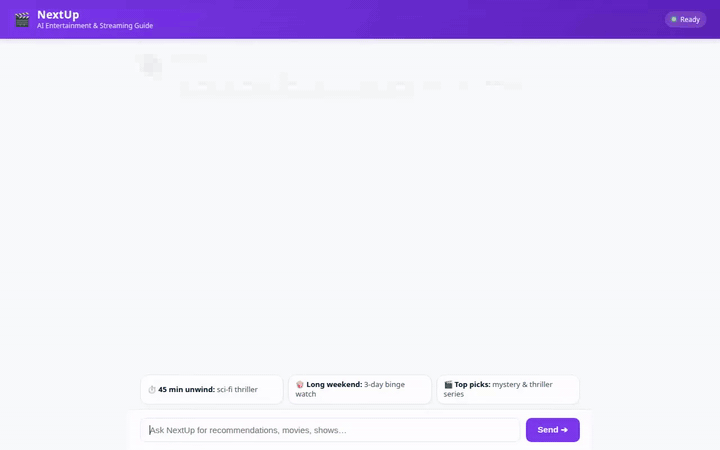
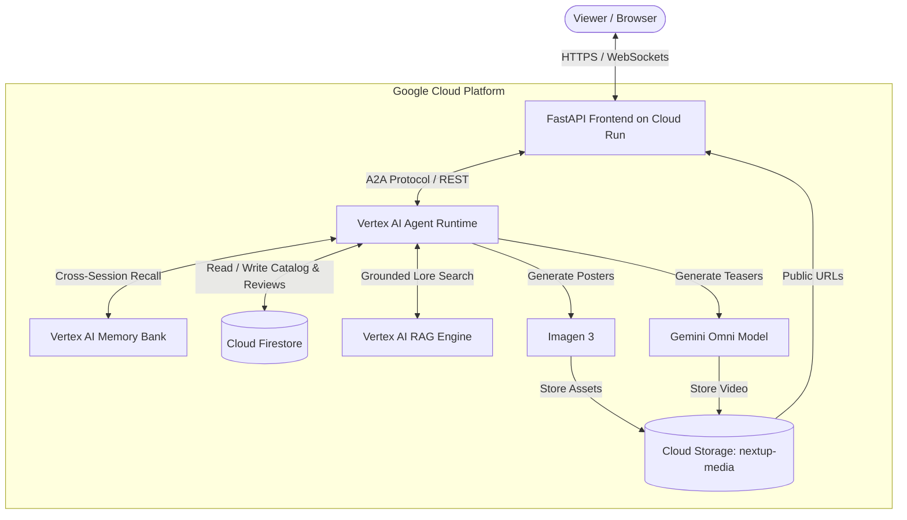

# 🎬 NextBinge — AI Entertainment & Streaming Concierge

> **A conversational agent that helps viewers discover what to watch with a catalog of movies and TV series tailored to their available time slots and evolving taste preferences.**

<div align="center">



<br/><br/>

[](https://antigravity.google)
[](https://cloud.google.com/products/agent-platform)
[](https://cloud.google.com/vertex-ai)
[](https://adk.dev/)
[](https://adk.dev/integrations/a2ui/)
[](https://cloud.google.com/run)

</div>

---

## 📖 Overview

Streaming fatigue and decision paralysis are ubiquitous: viewers spend more time scrolling through endless thumbnails than actually enjoying content. **NextBinge** is an intelligent, agentic entertainment concierge that eliminates this friction.

Instead of generic popularity lists, NextBinge:
- **Respects your available time slot**: Whether you have 45 minutes to unwind on a weeknight, 2 hours for a movie night, or a 3-day holiday weekend to binge an entire series, NextBinge calculates runtimes and episode bundles to guarantee a perfect fit.
- **Learns your evolving taste profile**: Powered by Vertex AI Memory Bank, NextBinge remembers your favorite directors, preferred genres, watched titles, and specific feedback across conversations.
- **Delivers rich visual previews**: Natively generates cinematic moodboard posters using **Imagen 3** and short video teasers using Google's **Omni model**, delivered via declarative **A2UI** cards.
- **Deeply understands lore and themes**: Grounded in a comprehensive entertainment guide through **Vertex AI RAG Engine**, NextBinge can explain complex narratives, episode benchmarks, and thematic parallels.

---

## ✨ Key Features

- ⏱️ **Time-Slot Fit Analysis**: Evaluates movie durations and single-episode or multi-episode runtimes to ensure recommendations comfortably fit your available schedule.
- 🔍 **Multi-Factor Entertainment Search**: Filters across format (movie vs. series), genres, duration, mood tags, lead studios (e.g. Warner Bros, Disney/Pixar), and narrative archetypes (Underdog, Quest, Monster Force).
- 🧠 **Cross-Session Long-Term Memory**: Seamlessly recalls preferences, watched titles, and previous recommendations from prior sessions without requiring manual re-entry.
- 🎨 **On-Demand Poster Artwork**: Generates custom high-resolution cinematic artwork with **Imagen 3** (`imagen-3.0-generate-002`) and stores them in Cloud Storage.
- 🎥 **Video Teaser Generation**: Creates custom teaser video previews using Google's Omni model (`gemini-omni-flash-preview`) rendered inline in the chat interface.
- 🗄️ **Interactive Watch Tracking**: Marks titles as watched and captures viewer ratings (1–10) and feedback notes directly into **Cloud Firestore**, instantly adapting future recommendations.
- 📚 **Grounded Thematic RAG**: Queries a curated entertainment knowledge base for deep-dive questions (e.g., explaining the dream architecture of *Inception*, the nuclear mechanics of *Chernobyl*, or the time loops of *Dark*).
- 🪟 **Agent-to-User Interface (A2UI)**: Declarative rich cards displaying titles, synopsis, duration, badges, artwork, and responsive HTML5 video players.

---

## ☁️ Google Cloud Tools & Architecture

NextBinge is built from the ground up on the **Google Cloud Agent Platform** ecosystem:

| Google Cloud Tool | Role in NextBinge | Implementation Details |
|---|---|---|
| 🧠 **Vertex AI Memory Bank** | Cross-session long-term memory | Connected via `PreloadMemoryTool` and memory generation callbacks. Persists user taste, favorite directors, and historical watch feedback. |
| 🗄️ **Google Cloud Firestore** | Structured catalog & state | Stores the catalog of movies and series in the `titles` collection. Tracks `watched` states, numeric ratings, and user reviews. |
| 📦 **Google Cloud Storage** | Media asset repository | Public bucket (`gs://nextup-media`) hosting generated posters (`/posters`) and teaser videos (`/videos`) with public HTTP access. |
| 📖 **Vertex AI RAG Engine** | Grounded thematic retrieval | Serverless RAG corpus grounded on `data/entertainment_guide.txt`, exposed to the agent as a function tool (`search_entertainment_guide`). |
| 🎨 **Imagen 3** | Cinematic poster generation | Model `imagen-3.0-generate-002` generating high-definition aesthetic moodboards and posters for titles in the catalog. |
| 🎬 **Gemini Omni** | Short teaser video generation | Model `gemini-omni-flash-preview` producing short video teasers uploaded to GCS and saved in session artifacts. |
| 🪟 **A2UI** | Rich conversational UI | Declarative Card, Column, Text, Image, and Video components rendered natively in the frontend chat view. |
| 🤖 **Agent Runtime** | Serverless agent hosting | ADK reasoning engine deployed to Vertex AI Agent Runtime in `us-east1` communicating over the A2A protocol. |
| 🚀 **Google Cloud Run** | Frontend hosting | Fully managed containerized FastAPI proxy and chat UI deployed in `us-east1`. |

---

## 🏛️ System Architecture



---

## 📁 Repository Structure

```
next-up/
├── app/
│   ├── agent.py                 # Core ADK agent definition & system instructions
│   ├── tools.py                 # Function tools (Firestore, Imagen, Omni, RAG, Watch Tracking)
│   ├── a2ui_utils.py            # A2UI after_model_callback formatting
│   ├── fast_api_app.py          # FastAPI application wrapper
│   └── app_utils/               # Runtime and config utilities
├── frontend/
│   ├── main.py                  # Cloud Run FastAPI A2A proxy server
│   ├── static/
│   │   └── index.html           # Branded chat UI with A2UI & Video Player support
│   └── Dockerfile               # Container definition for Cloud Run
├── data/
│   ├── entertainment_guide.txt  # RAG corpus grounding document
│   └── HollywoodMovies.csv      # Enriched Hollywood films dataset (970 titles)
├── tests/
│   ├── unit/                    # 19 comprehensive pytest unit tests
│   └── eval/
│       ├── eval_config.yaml     # Custom response quality evaluation rubric
│       └── datasets/
│           ├── basic-dataset.json            # 16 single-turn benchmark test cases
│           └── nextup_benchmark_dataset.json # Mirrored evaluation benchmark
├── assets/
│   └── demo.gif                 # Optimized looping demonstration recording
├── nextup_demo.webm             # Full-length 1280x800 recorded demo video
├── pyproject.toml               # Python project configuration & dependencies
└── README.md                    # Project documentation
```

---

## 🚀 Quick Start

### Prerequisites
- Python 3.11+
- [uv](https://docs.astral.sh/uv/) package manager
- [Google Cloud SDK (`gcloud`)](https://cloud.google.com/sdk/docs/install)
- `google-agents-cli` (`uv tool install google-agents-cli`)

### 1. Installation
Clone this repository and install dependencies:
```bash
git clone https://github.com/cszhu/build-with-gemini.git
cd build-with-gemini/next-up
uv sync
```

### 2. Configure Environment
Set your active Google Cloud project:
```bash
gcloud config set project <YOUR_PROJECT_ID>
gcloud auth application-default login
```

### 3. Run Locally
Start the local FastAPI chat frontend:
```bash
export AGENT_ENGINE_RESOURCE_NAME="projects/<PROJECT_NUMBER>/locations/us-east1/reasoningEngines/<ENGINE_ID>"
export AGENT_DIRECTORY="app"
export PORT=8080
python frontend/main.py
```
Open **`http://localhost:8080`** in your browser to chat with NextBinge.

---

## 🧪 Evaluation

NextBinge includes a comprehensive 16-case benchmark dataset covering:
- Time-constrained recommendations (e.g. 45-minute evening slots).
- Multi-day binge planning for holiday weekends.
- Hollywood critic acclaim (Rotten Tomatoes $\ge 90\%$) vs. crowd-pleasers (Audience Score $\ge 90\%$).
- Narrative archetypes (Underdog, Quest, Monster Force) and Studio spotlights (Disney/Pixar, Warner Bros).
- Live watch tracking and feedback persistence.

Run automated evaluation using `agents-cli`:
```bash
agents-cli eval run \
  --dataset tests/eval/datasets/basic-dataset.json \
  --config tests/eval/eval_config.yaml
```

Run unit tests:
```bash
uv run pytest tests/unit/
```

---

## 🚢 Deployment

### Deploy Agent to Vertex AI Agent Runtime
```bash
agents-cli deploy --project <PROJECT_ID> --region us-east1
```

### Deploy Frontend to Cloud Run
```bash
gcloud run deploy next-up-frontend \
  --source frontend \
  --region us-east1 \
  --allow-unauthenticated \
  --set-env-vars AGENT_ENGINE_RESOURCE_NAME="projects/<PROJECT_NUMBER>/locations/us-east1/reasoningEngines/<ENGINE_ID>"
```

---

## 📄 License
This project is licensed under the Apache 2.0 License.
